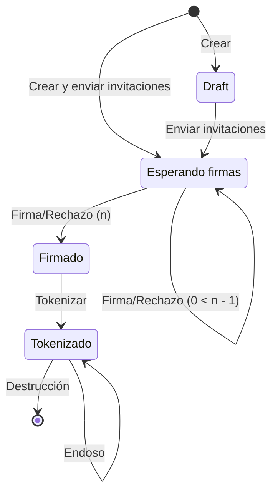

Los documentos son la base de la plataforma. Debido a que la legislación hace referencia a _mensajes de datos_, utilizamos el término _documento_ para referirnos a cualquier tipo de mensaje de datos que pueda ser firmado electrónicamente.

<Check>
Todos los documentos de la plataforma obtienen certificados de conservación en la blockchain de forma gratuita a través del [testigo del sistema de información](/advanced/technical/information-system/witness).
</Check>

## Tipos de documentos

La plataforma soporta 4 tipos de mensajes de datos:

- **Textos**: Textos simples, ideal para aceptación de términos y condiciones o consultas a instituciones de información crediticia.
- **PDFs**: Documentos de formato libre en PDF, pueden ser cualquier cosa que el equipo legal de la empresa requiera.
- **Pagarés**: Títulos de crédito especializados en deuda, incluyen una representación en texto del derecho de pago y son tokenizados en automático.
- **JSON**: Mensajes de datos estructurados en formato JSON, ideal para integraciones con sistemas de información.

## Conservación de mensajes de datos

De acuerdo con la [NOM-151](/advanced/technical/electronic-signature/trust-service-providers#certificados-de-nom-151), los requisitos que se deben de observar para la conservación de mensajes de datos pueden ser cumplidos a través de las siguientes opciones:

- **Conservación en blockchain**: Los mensajes de datos son conservados en la blockchain de forma inmutable y con un _timestamp_ gracias al [testigo del sistema de información](/advanced/technical/information-system/witness).
- **Conservación en NOM-151 agrupada**: Los mensajes de datos son agrupados en un [árbol de Merkle](/advanced/technical/electronic-signature/data-message-conservation#merkle-tree) para reducir los costos de certificación. El conjunto recibe un _timestamp_ de un proveedor de servicios de certificación.
- **Conservación en NOM-151 individual**: Los mensajes de datos son certificados de forma individual por un [proveedor de servicios de certificación](/advanced/technical/electronic-signature/trust-service-providers).

El certificado en Blockchain está incluido de forma gratuita en todos los documentos, mientras que las certificaciones del PSC son limitadas por [créditos en la plataforma](/advanced/organizations#cuotas-de-documentos).

Los usuarios pueden revisar su disponibilidad de cuotas para certificados NOM-151 en la sección de configuración en su [organización](/advanced/organizations) en la aplicación web.

<Frame>

</Frame>

<Note>Cada organización cuenta con 5 documentos con certificado NOM-151 de cortesía, y 25 documentos con certificación en blockchain.</Note>

## Ciclo de vida de un documento

El firmado electrónico en Plumaa ID se gestiona a través de un ciclo de vida estandarizado. Este ciclo de vida permite que el documento obtenga diversas fuentes de confianza desde su creación hasta su potencial tokenización.

<Frame>

</Frame>

### Estados

- **Draft (D)**: Documento creado pero no enviado.
- **Esperando firmas (W)**: Documento enviado y esperando firmas.
- **Firmado (S)**: Documento firmado por todas las partes.
- **Tokenizado (T)**: Documento tokenizado y listo para ser endosado.

## Creación de documentos

Los documentos en Plumaa ID pueden ser creados desde la interfaz web o a través de la API. El documento puede ser creado como un draft, lo que evitará que los invitados reciban notificaciones hasta que el documento esté listo para ser firmado.

🚧 En progreso...

### Invitaciones

Los documentos podrán añadir nuevos invitados en cualquier momento. Los invitados recibirán una notificación y verán la invitación disponible en la aplicación móvil hasta que el documento esté listo para ser firmado.

### Invitaciones de firmado

🚧 En progreso...

#### ¿Cómo invitar a firmar a un usuario?

🚧 En progreso...

### Finalización

Una vez que todos los invitados hayan firmado el documento el documento se marcará como finalizado y no procesará más firmas.

### Tokenización

En algunos casos, los documentos firmados pueden ser convertidos en piezas digitales para su posterior endoso en el sistema de información de Plumaa ID.

Las organizaciones deberán especificar a un propietario inicial que podrá reclamar el endosable digital. Este propietario podrá transferir la pieza digital a otros propietarios a través de la aplicación móvil.

<Tip>Revisa la guía de [tokenización](/advanced/tokenization).</Tip>

