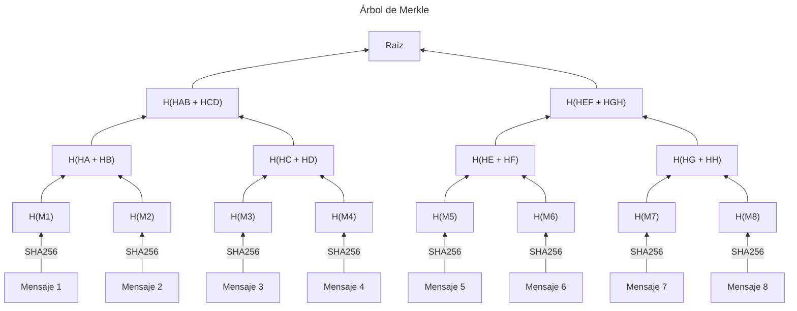
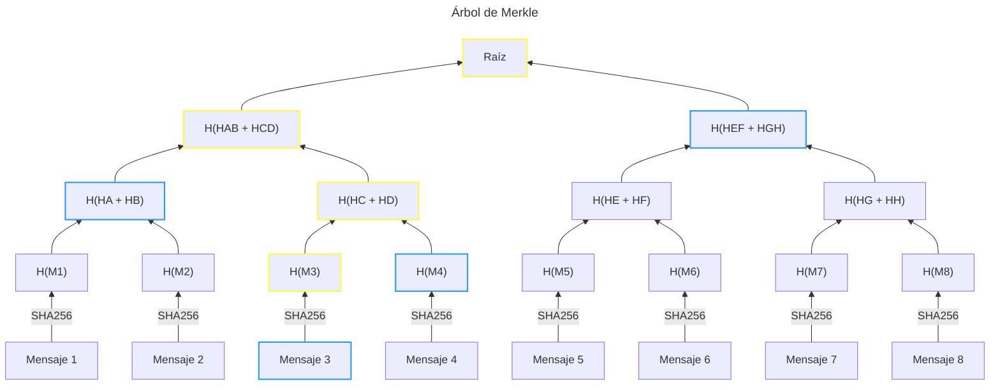

La conservación de mensajes de datos es un procedimiento que se vale de la cadena de confianza de la infraestructura de seguridad extendida de Banxico para que un [PSC](/advanced/electronic-signature/trust-service-providers) se comprometa a respaldar una fecha asociada a un mensaje de datos.

## ¿Qué es la conservación de mensajes de datos?

Conservar un mensaje de datos significa dejar un registro del digestivo (ver [fundamentos técnico](/advanced/electronic-signature/what-is-an-advanced-electronic-signature#fundamento-tecnico)) de un documento en un momento específico. Este registro se asocia a una fecha y a una firma electrónica que garantiza que el digestivo no ha sido alterado desde el momento en que su conservación se registró hasta el momento en que se verifica.

<Warning>Un certificado de conservación de mensaje de datos no garantiza que el documento se conserve. En realidad, certifica su conservación si el mensaje de datos ha sido mantenido con integridad por alguna de las partes involucradas.</Warning>

## NOM-151

Ver [Certificados de NOM-151](/advanced/electronic-signature/trust-service-providers#certificados-de-nom-151).

## Conservación en Blockchain

El registro distribuido de una blockchain tiene una característica que lo hace ideal para la conservación de mensaje de datos: **la inmutabilidad**. Adicionalmente, cada registro cuenta con una fecha de inclusión que es acordada por los validadores de la red, siendo una fuente confiable, neutra y accesible para obtener un _timestamp_ para un mensaje de datos.

Conservar un mensaje de datos con blockchain consiste en registrar el hash de un documento en una transacción de la red. Sin embargo, existen mecanismos alternativos por los cuáles la conservación se puede simplificar para reducir los costos de certificación al agrupar múltiples documentos.

<Tip>Debido a que la conservación garantiza que un documento existe de forma _íntegra y sin alteraciones_ desde el momento de su creación, es suficiente con demostrar que su digestivo tiene un registro con fecha para determinar su conservación.</Tip>

### Merkle Tree

Un [árbol de Merkle](https://es.wikipedia.org/wiki/%C3%81rbol_de_Merkle) es una estructura de datos criptográfica que permite agrupar múltiples mensajes de datos en un sólo digestivo. Esto es posible gracias a la resistencia a preimagen que tienen las funciones de hash.

Supongamos que tenemos 8 mensajes de datos y queremos conservarlos en un sólo digestivo. Para agruparlos en un árbol de Merkle es necesario obtener los digestivos de todos los mensajes de datos y agruparlos en pares. La concatenación de cada par será procesada con la misma función de hash para reducir la cantidad de mensajes de datos a 4.

Al repetir este proceso, se obtendrán 2 digestivos en el siguiente nivel, y finalmente 1 sólo digestivo en la raíz del árbol.

La raíz del Árbol se coloca en la cadena de bloques para que cualquier persona pueda verificar de forma pública que un mensaje de datos pertenece a la raíz del árbol registrada en la fecha del bloque.

#### Prueba de inclusión de un mensaje de datos

Para probar que un mensaje de datos pertenece al árbol, basta con presentar la cadena de hash desde el mensaje de datos hasta la raíz del árbol. Por ejemplo, en caso de querer probar que el mensaje 3 pertenece al árbol, se presentaría el mensaje de datos acompañado por los hash `H(M4)`, `H(HA + HB)`, `H(HEF + HGH)`.

Este conjunto de hashes que permiten recrear la raíz del árbol es conocido como _path de Merkle_. Y el procedimiento de verificación consistiría en lo siguiente.

1. Alicia presenta el mensaje 3 y el path de Merkle.
2. Bob obtiene `H(M3)` al aplicar la función de hash al mensaje 3.
3. Bob obtiene `H(HC + HD)` al aplicar la función de hash a `H(M3)` y `H(M4)`.
4. Bob obtiene `H(HAB + HCD)` al aplicar la función de hash a `H(HA + HB)` y `H(HC + HD)`.
5. Bob obtiene la raíz al aplicar la función de hash a `H(HABCD)` y `H(HEFGH)`.

<Check>En caso de que la raíz obtenida coincida con alguna que se pueda encontrar de forma pública y con fecha en la blockchain, entonces se puede asumir con seguridad que el documento fue conservado desde el momento en que la raíz se registró en un bloque.</Check>

- En _Azul_, los elementos que se presentan para verificar la inclusión de un mensaje de datos.
- En _Amarillo_, los elementos que se producen al aplicar la función de hash a los elementos en _Azul_.

<Check>Este mecanismo tiene la ventaja de ahorrar costos de transacción al agrupar múltiples mensajes de datos</Check>

#### ¿Cómo verificar la conservación de un mensaje de datos?

Para validar la conservación de un mensaje de datos de forma descentralizada y sin necesidad de la intermediación de Plumaa ID, es suficiente con hacer una consulta utilizando el digestivo del mensaje de datos y su _merkle path_ a algún contrato inteligente que implemente este mecanismo.

<Tip>En el caso de Plumaa ID, la conservación es garantizada por el [Testigo](/advanced/information-system/components/witness) del sistema de información de Plumaa ID</Tip>

### Margen de error del timestamp

La conservación de mensajes de datos tiene un margen de error que se presenta por la diferencia entre el momento en que se genera el documento y unos minutos en lo que se acumulan otros mensajes de datos en el sistema de registro de Plumaa ID.

Este margen de error puede ser de hasta una hora, pero es suficiente para garantizar la integridad de los mensajes de datos conservados y es suficiente para la mayoría de los casos de uso y para el requisito de fecha cierta en la conservación de documentos.
