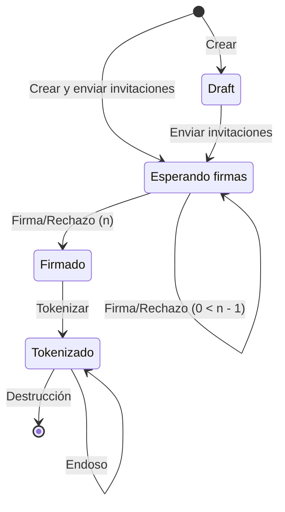

## Overview

El firmado electrónico en Plumaa ID se gestiona a través de un ciclo de vida estandarizado. Este ciclo de vida permite que el documento obtenga diversas fuentes de confianza desde su creación hasta su potencial tokenización.

### Estados

- **Draft (D)**: Documento creado pero no enviado.
- **Esperando firmas (W)**: Documento enviado y esperando firmas.
- **Firmado (S)**: Documento firmado por todas las partes.
- **Tokenizado (T)**: Documento tokenizado y listo para ser endosado.

## Creación de documentos

Los documentos en Plumaa ID pueden ser creados desde la interfaz web o a través de la API. El documento puede ser creado como un draft, lo que evitará que los invitados reciban notificaciones hasta que el documento esté listo para ser firmado.

### Invitaciones

Los documentos podrán añadir nuevos invitados en cualquier momento. Los invitados recibirán una notificación y verán la invitación disponible en la aplicación móvil hasta que el documento esté listo para ser firmado.

### Finalización

Una vez que todos los invitados hayan firmado el documento el documento se marcará como finalizado y no procesará más firmas.

### Tokenización

En algunos casos, los documentos firmados pueden ser convertidos en piezas digitales para su posterior endoso en el sistema de información de Plumaa ID.

Las organizaciones deberán especificar a un propietario inicial que podrá reclamar el endosable digital. Este propietario podrá transferir la pieza digital a otros propietarios a través de la aplicación móvil.

<Tip>En el caso de documentos que son endosables por naturaleza, el documento será tokenizado automáticamente. Por ejemplo, en los pagarés, el poseedor inicial siempre será el acreditado en el pagaré.</Tip>
