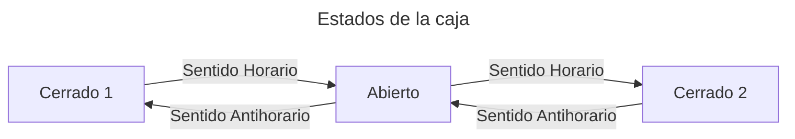
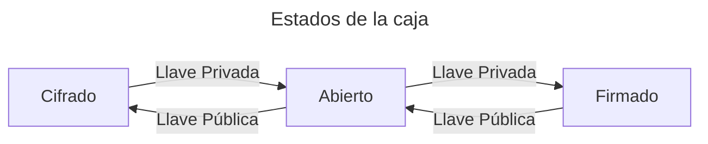

La firma electrónica es un concepto amplio que abarca diversas formas de comprobar la manifestación de la voluntad de un firmante. Sin embargo, existe una diferencia primordial entre las firmas electrónicas que dependen de la criptografía y las que no.

## Firmas no criptográficas

Este tipo de firmas se caracterizan por emular las características físicas de la firma electrónica. El ejemplo más popular es el NIP de una tarjeta de crédito, donde, por su naturaleza, puede ser transferido a otro usuario simplemente comunicando el NIP y la tarjeta física.

Su valor probatorio dependerá de la robustez de los mecanismos de autenticación que se utilicen para verificar la identidad del firmante a juicio de la autoridad competente.

## Firmas criptográficas

Las firmas criptográficas, por otro lado, deben su valor probatorio a la completitud matemática de los algoritmos de los que se sostiene.

Estos algoritmos utilizan _trucos_ aritméticos para dotar de propiedades a la información. Por ejemplo, la **integridad** de la firma y del documento electrónico puede ser comprobada a través de funciones de hash estandarizadas y reconocidas por la secretaría de economía como el `SHA256`.

Otro ejemplo de propiedad de la información que se obtiene a través de algoritmos es la **autenticidad**, que se logra a través de un algoritmo de firmado electrónico, como `RSA` en el caso de las implementaciones de la IES del Banco de México o `P256` en el enclave de seguridad de los dispositivos Apple.

### RSA

El criptosistema `RSA` es un conjunto de algoritmos de clave pública que se utiliza para cifrar, decifrar, firmar y verificar mensajes de datos. Su robustez se basa en la dificultad computacional de factorizar números primos grandes.

<Info>
Este es el algoritmo utilizado por la infraestructura de seguridad de Banxico.
</Info>

#### ¿Cómo funciona?

Alicia y Bob desean comunicarse de forma segura. Idealmente, ambos están buscando que su información sea compartida de tal forma que se aseguren las siguientes propiedades de la información que se comparten:

- **Integridad**: La información no ha sido alterada.
- **Autenticidad**: La información proviene de quien dice ser.
- **No repudio**: El firmante no puede negar haber firmado el documento.

Para lograr esto, ambos utilizan una caja especial que tiene 2 llaves: una que gira en sentido horario y otra en sentido antihorario.

<Frame>

</Frame>

Este sistema de caja permite que si Alice mantiene la llave que gira en sentido horario en privado y comparte públicamente la llave que gira en sentido antihorario, entonces Bob podría utilizar su llave pública para cerrar la caja de tal forma que **solo Alicia podría acceder a su contenido**. 

Así, el contenido de la caja se cifraría para que solo Alicia pudiera descifrarlo.

Por su parte, una amenaza de este modelo es que Alice no tendría forma de verificar que el contenido de la caja fue enviado por Bob. Para resolver esto, Bob podría enviar un mensaje cifrado con la llave privada de Bob, de tal forma que Alice pudiera **verificar que el contenido fue enviado por Bob**.

De esta forma, el contenido de la caja estaría firmado por Bob.

<Frame>

</Frame>

Este principio es la base de la criptografía RSA-

### Otros algoritmos basados en curvas elípticas

Los algoritmos basados en curvas elípticas son una familia de algoritmos que utilizan la geometría de curvas elípticas para generar firmas electrónicas.

Las curvas elípticas tienen la forma $$y^2 = x^3 + a x + b$$ en su forma simplificada y son generalmente más eficientes que RSA en términos de tamaño de llave y velocidad de operación.

Desafortunadamente, estos algoritmos no están considerados en la regulación mexicana, por lo que no son utilizados en la infraestructura de seguridad de Banxico.

#### P256

Es un algoritmo de curvas elípticas que opera sobre el campo secp256r1. Es utilizado por Apple en su enclave de seguridad para firmar y verificar mensajes de datos.

<Info>
P256 es una curva estandarizada por la NIST (National Institute of Standards and Technology).
</Info>

#### secp256k1

Es un algoritmo de curvas elípticas que opera sobre el campo secp256k1. Es utilizado por Bitcoin y Ethereum para firmar y verificar transacciones.

## Firma Electrónica Simple

En el contexto del derecho mexicano, el término de _firma electrónica_ simple es utilizado para referirse a aquellas firmas electrónicas que no reunen los requisitos de **fiabilidad** del artículo 97 del Código de Comercio. Estas firmas son generalmente no criptográficas, y en caso de serlo, puede que carezcan de algunos requisitos que son garantizados por la infraestructura de seguridad extendida de Banxico.
