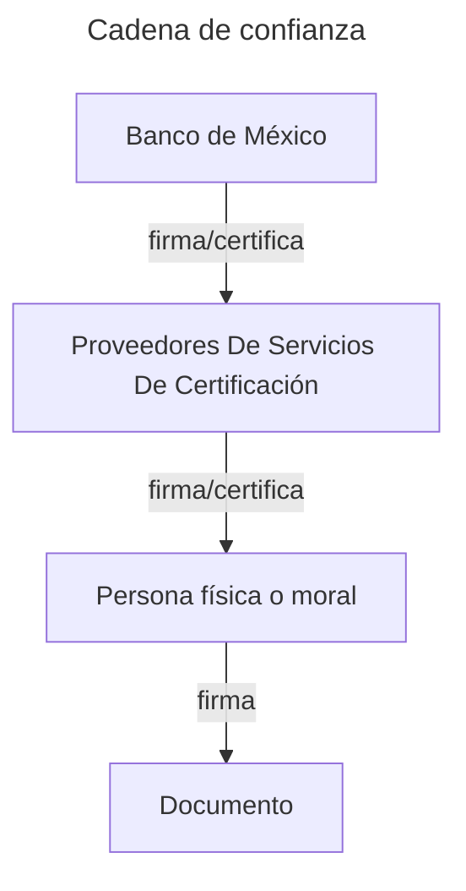

# ¿Qué es una firma?

Una firma _autógrafa_ tradicional es un signo distintivo que una persona traza en un documento para manifestar su voluntad de aceptar las condiciones que en él se establecen. En el mundo digital, una firma es un conjunto de datos que se adjunta a un documento para garantizar su autenticidad y la identidad de su autor.

En el caso concreto de las firmas electrónicas basadas en criptografía como las [que produce Plumaa ID](/basics/terminology#firma-electronica-avanzada), los datos de la firma están lógicamente relacionados a un identificador, mismo que está vinculado al firmante a través de un certificado digital.

Contrario a lo que se podría pensar, una firma electrónica no es una imagen de la firma autógrafa del firmante, sino un conjunto de datos que se generan a partir de la información del documento y la <Tooltip tip="Es un número secreto muy largo usualmente entregado en un archivo (.key), y que a través de fórmulas matemáticas produce un resultado único para el firmante y el documento">[llave privada](/basics/terminology#llave-privada)</Tooltip> del firmante.

## La expresión de la voluntad

En el mundo físico, la expresión de la voluntad normalmente se manifiesta a través de la escritura de un nombre o la realización de un dibujo. Por tanto, su prueba en juicio se basa en la comparación de la firma con la de un documento de identidad o con una firma autógrafa.

<Warning>
Al compartir fotografías de tus documentos digitales y escaneos faciales, los usuarios se ven expuestos a riesgos de robo de identidad de forma innecesaria.
</Warning>

Este proceso es conocido como _peritaje caligráfico_ y es realizado por un _perito calígrafo_ que es un experto en la identificación de firmas y escritura. Sin embargo, el proceso es lento, tardado, costoso y además involucra una evaluación subjetiva.

En el mundo digital, la expresión de la voluntad se puede recrear esencialmente de dos maneras:

1. **Recrear los requerimientos físicos en digital**
2. **Utilizar un enfoque basado en matemáticas**

El primero usualmente toma la forma de una _firma autógrafa en dispositivo digital_ o a través del _intercambio de claves_ como el NIP de una tarjeta de crédito.

<Note>
Este esquema también es conocido como [_firma electrónica simple_](/basics/terminology#firma-electronica-simple).
</Note>

Por el contrario, el segundo enfoque proporciona la capacidad de garantizar la autenticidad de la firma y la identidad del firmante a través de métodos matemáticos, removiendo la subjetividad. La tecnología de Plumaa ID depende mayormente de servicios abiertos debido a que su seguridad es garantizada a través de la transparencia y la descentralización.

## Firma digital

La [firma digital](https://es.wikipedia.org/wiki/Firma_digital) es un tipo de esquema que garantiza ciertas propiedades de la información, como el _no repudio_ y la _integridad_.

En México, el [Código de Comercio](https://www.diputados.gob.mx/LeyesBiblio/pdf/CCom.pdf) considera una firma como _fiable_ si cumple con los siguientes requisitos en conformidad con su artículo 97:

<AccordionGroup>
  <Accordion title="El firmante es identificable" icon="id-card">
    > Los Datos de Creación de la Firma, en el contexto en que son utilizados, corresponden exclusivamente al Firmante;

    La [Infraestructura de Seguridad Extendida](#infraestructura-de-seguridad-extendida-ies) de Banxico asegura que el firmante es identificable a través de un certificado digital emitido por un Proveedor de Servicios de Certificación (PSC).
  </Accordion>

  <Accordion title="Nadie más que el firmante tiene acceso a la llave privada que firma" icon="signature">
    > Los Datos de Creación de la Firma estaban, en el momento de la firma, bajo el control exclusivo del Firmante;

    Con Plumaa ID, los datos de creación de firma nunca abandonan el dispositivo y se generan en el momento de la firma.
  </Accordion>

  <Accordion title="La firma electrónica es íntegra" icon="fingerprint">
    > Es posible detectar cualquier alteración de la Firma Electrónica hecha después del momento de la firma, y

    Cualquier mínina alteración en los datos electrónicos que representan la firma electrónica es fácilmente detectable.
  </Accordion>
  <Accordion title="La información firmada es íntegra" icon="fingerprint">
    > Respecto a la integridad de la información de un Mensaje de Datos, es posible detectar cualquier alteración de ésta hecha después del momento de la firma.
  
    Alterar el más mínimo detalle de la información firmada invalida la firma electrónica. 
  </Accordion>
</AccordionGroup>

Gracias a los métodos matemáticos inherentes a la firma electrónica avanzada, es posible garantizar estas propiedades de forma automática y sin la necesidad de un perito calígrafo.

### No repudio

El _no repudio_ es una propiedad de la firma electrónica avanzada que garantiza que el firmante no puede negar haber firmado un documento. Esto es posible gracias a que la firma electrónica avanzada es única para cada documento y firmante, y además, es impráctico de falsificar.

<Tip>En México, la firma electrónica avanzada posee presunción de validez, lo cuál supone ventajas operativas enormes debido a que aquel que tiene que probar la invalidez de la firma es el firmante.</Tip>

### Control total del firmante

La aplicación móvil de Plumaa ID garantiza que el firmante tiene el control total de su llave privada. Esto es posible a través de técnicas de cifrado criptográfico que utilizan tecnologías implementadas en dispositivos móviles.

<Note>La llave privada nunca abandona el dispositivo y es almacenada de forma segura en el almacenamiento seguro del dispositivo.</Note>

# Seguridad

## Garantías de la firma electrónica avanzada

La seguridad del firmado electrónico depende principalmente de 2 factores:

1. La seguridad del algoritmo de firma
2. La cadena de confianza entre autoridades

### Algoritmo de firma (RSA)

El algoritmo de firma es el método matemático que se utiliza para generar la firma electrónica. [El SAT](/basics/terminology#servicio-de-administracion-tributaria-sat) y otros [PSCs](/basics/terminology#proveedores-de-servicios-de-certificacion-psc) utiliza el [algoritmo RSA](/advanced/electronic-signature/what-is-an-advanced-electronic-signature#criptosistema-rsa) con una longitud de llave de 2048 bits.

Dicho algoritmo prueba con certeza el vínculo entre la firma y una clave pública. Sin embargo, lo que vincula a una persona registrada e identificada ante una autoridad con una clave pública es la cadena de confianza.

### Cadena de Confianza

En esencia, la cadena de confianza es un procedimiento de múltiples firmas de certificados de autoridad.

## Dependencia en la Infraestructura de Seguridad Extendida (IES)

La [Infraestructura de Seguridad Extendida del Banco de México](https://www.banxico.org.mx/servicios/certificados-ies-firma-electr.html) es una [infraestructura de clave pública](https://es.wikipedia.org/wiki/Infraestructura_de_clave_p%C3%BAblica) que permite a los PSCs emitir certificados de firma electrónica avanzada a personas físicas y morales.

Este modelo sostiene la cadena de confianza utilizando el mismo algoritmo de firmado y la misma autoridad certificadora (Banxico), lo que garantiza la interoperabilidad entre los certificados emitidos por los PSCs.

## Validación de Certificado - Online Certificate Status Protocol (OCSP)

OCSP es un protocolo de red que se utiliza para obtener el estado de un certificado digital. Para la firma electrónica avanzada, este protocolo permite evaluar si un certificado sigue siendo válido.

En el caso de que un usuario pierda su llave privada y el acceso total a su firma, este puede revocar su certificado a través del PSC emisor. De esta forma, Plumaa ID es incapaz de procesar una firma que provenga de un certificado previamente revocado.

<Warning>Por esta razón es de suma relevancia notificar a la autoridad cuando perdemos el control de nuestra llave privada</Warning>
