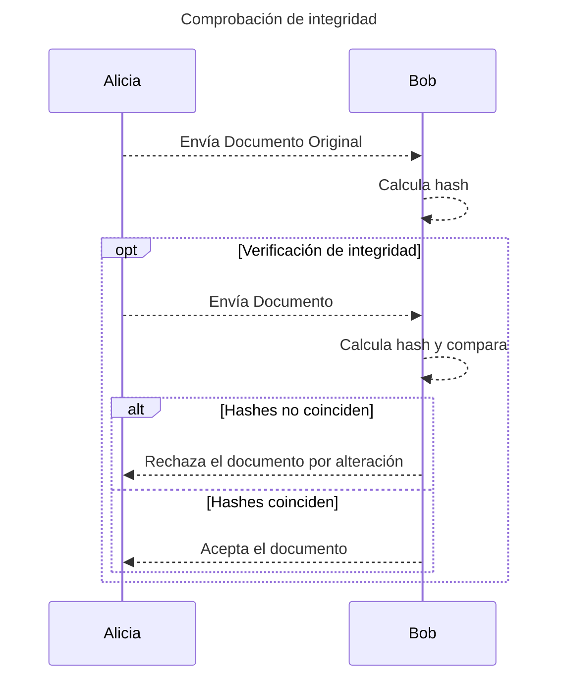

La firma electrónica avanzada del SAT es una firma basada en el el [criptosistema RSA](/technical//electronic-signature/what-is-an-electronic-signature#rsa) que cumple con los requisitos de la [Ley de Firma Electrónica Avanzada](https://www.diputados.gob.mx/LeyesBiblio/pdf/LFEA_200521.pdf) y que se utiliza para firmar documentos electrónicos.

## Fundamento legal

La firma electrónica avanzada está regulada en México en términos de la [Ley de Firma Electrónica Avanzada](https://www.diputados.gob.mx/LeyesBiblio/pdf/LFEA_200521.pdf) se utiliza para firmar documentos electrónicos.

Asimismo, el Código de Comercio en su artículo 97 establece los requisitos que debe cumplir una firma para ser considerada como fiable para actos de comercio. Entre estos requisitos se encuentran:

> I. Los Datos de Creación de la Firma, en el contexto en que son utilizados, **corresponden exclusivamente al Firmante**;
>
> II. Los Datos de Creación de la Firma estaban, en el momento de la firma, **bajo el control exclusivo del Firmante**;
>
> III. Es posible **detectar cualquier alteración** de la Firma Electrónica hecha después del momento de la firma, y
>
> IV. Respecto a la integridad de la información de un Mensaje de Datos, es posible **detectar cualquier alteración** de ésta hecha después del momento de la firma.

### Equivalencia funcional

La firma electrónica avanzada es equivalente a la firma autógrafa en términos de validez jurídica. Esto significa que los mensajes de datos firmados electrónicamente tienen la misma validez independientemente de la forma en la que se presenta el mensaje.

Esto, en conformidad con el Artículo 89 del Código de Comercio:

> Las actividades reguladas por este Título se someterán en su interpretación y aplicación a los principios de [...] equivalencia funcional del Mensaje de Datos en relación con la información documentada en medios no electrónicos y de la Firma Electrónica en relación con la firma autógrafa.

Adicionalmente, por equivalencia, se puede trasladar la definición en términos de la Ley de Firma Electrónica Avanzada:

> Equivalencia Funcional: Consiste en que la firma electrónica avanzada en un documento electrónico o en su caso, en un mensaje de datos, satisface el requisito de firma del mismo modo que la firma autógrafa en los documentos impresos

### Certificados de la Infraestructura de Seguridad Extendida (IES)

La Infraestructura de Seguridad Extendida de Banxico es, en realidad, un conjunto de documentos electrónicos que permiten reconstruir la cadena de confianza que completa los requisitos de ley para garantizar la fiabilidad de las firmas.

<Tip>
Estos certificados los puedes encontrar en la fuente oficial de la [IES de Banxico](https://www.banxico.org.mx/servicios/certificados-ies-firma-electr.html)
</Tip>

### No Repudio

El no repudio es una propiedad de la firma electrónica que se originó como un concepto de la criptografía. En la práctica, es una construcción matemática que es resultado de diferentes componentes lógicos envueltos entre el firmante, los [PSCs](/technical//electronic-signature/trust-service-providers), el Banco de México.

<Note>
La seguridad bancaria depende de los algoritmos de firmado criptográfico y se basan en el no repudio para automatizar operaciones financieras de alto riesgo.
</Note>

En términos de la Ley de Firma Electrónica Avanzada:

> No Repudio: Consiste en que la firma electrónica avanzada contenida en documentos electrónicos garantiza la autoría e integridad del documento y que dicha firma corresponde exclusivamente al firmante, y

## Fundamento técnico

### Función Digestivo

Las funciones digestivo (o hash) son funciones que toman un mensaje de longitud arbitraria y lo transforman en un mensaje de longitud fija, y tienen 3 propiedades fundamentales:

1. **Determinismo**: Dado un mensaje, siempre se obtiene el mismo hash
2. **Resistencia a la preimagen**: Dado un hash, es computacionalmente imposible encontrar el mensaje original
3. **Resistencia a la colisión**: Es computacionalmente imposible encontrar dos mensajes distintos que generen el mismo hash

La Secretaría de Economía reconoce el uso de las funciones digestivo SHA-256 para la conservación de mensajes de datos.

Formalmente, un hash se puede expresar de la siguiente manera:

$$h = H(m)$$

Donde:

- $$h$$ es el hash del mensaje
- $$H$$ es la función digestivo

Para verificar la integridad de un documento, se puede comparar el hash del documento original con el hash del documento firmado.

### Criptosistema RSA

El criptosistema RSA se puede formalizar de la siguiente manera:

$$c \equiv m^d \mod n$$

Donde:

- $$c$$ es el mensaje cifrado (sea firma o encriptado)
- $$m$$ es el mensaje a firmar (i.e. el digestivo del documento)
- $$d$$ es la llave privada
- $$n$$ es el módulo de la llave privada

Para falsificar un mensaje cifrado, un atacante necesitaría la llave privada $$d$$ tal que $$c \equiv m^d \mod n$$, lo cual es computacionalmente imposible debido a las características de la aritmética modular (i.e. `mod n`)

En la práctica, existen esquemas de verificación de firmado electrónico definido por diversos estándares criptográficos de internet. Estos procedimientos son determinados por las disposiciones generales de la Ley de Firma Electrónica Avanzada.
