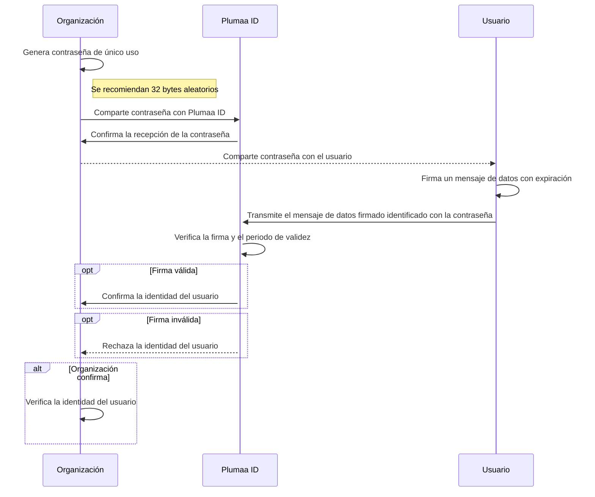

Tal como se explicó en la [verificación de identidad](/use-cases/verify-identity), Plumaa ID permite establecer protocolos de verificación de identidad

## ¿Cómo verifico la identidad de un usuario?

Plumaa ID ofrece un API REST a través del cuál se pueden realizar solicitudes de autenticación. El procedimiento se puede visualizar en un diagrama de secuencia de la siguiente manera:

De esta forma, una organización puede permitir el acceso a un usuario a través de un flujo de autenticación robusto y seguro.

<Note>
  Plumaa ID no almacena este mensaje de datos ni la firma debido a que se asume que su conservación es innecesaria en este contexto.
</Note>

<Tip>
  Plumaa ID se asegura de que la firma transmitida sea válida y que el periodo de validez no haya expirado. Aún así, se recomienda que la organización verifique la autenticidad de la firma y el periodo de validez para completa seguridad.
</Tip>

## Doble factor de autenticación

En concordancia con las Disposiciones de Carácter General Aplicables a las Instituciones de Crédito, la contraseña intercambiada como parte del protocolo de verificación de identidad puede ser considerada como un factor de autenticación de categoría 3. Adicionalmente, la firma del mensaje de datos puede ser considerada como un factor de autenticación de categoría 4.

De forma conjunta, este flujo de autenticación garantiza un nivel de seguridad de 2 factores de autenticación.
